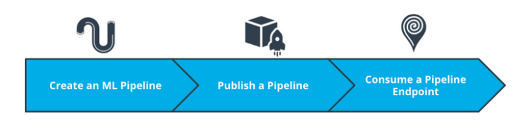
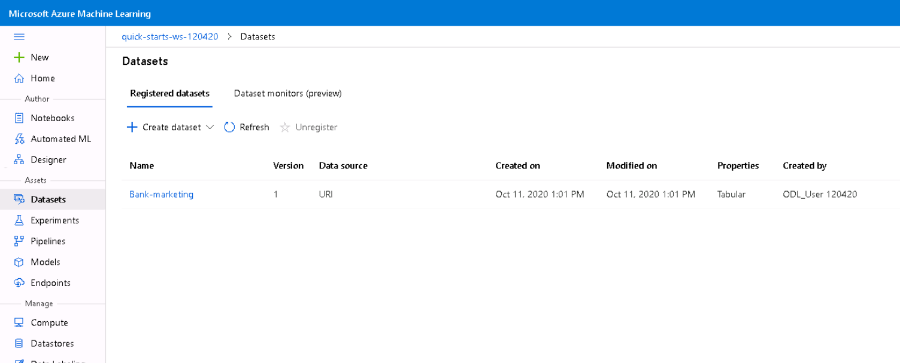
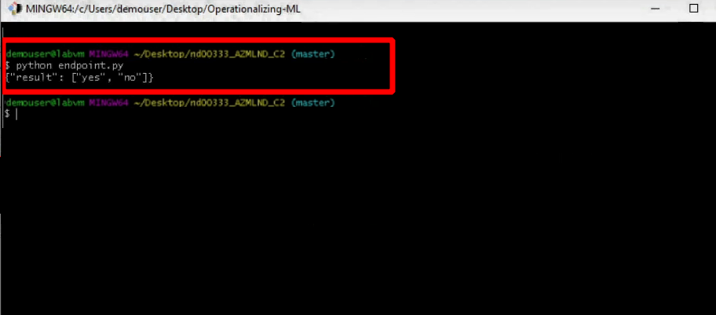
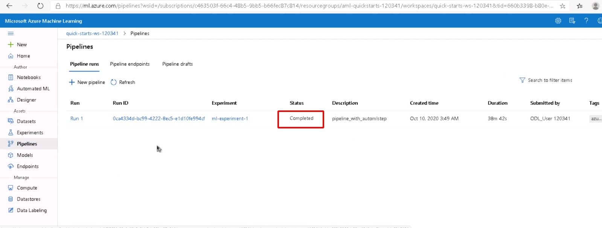
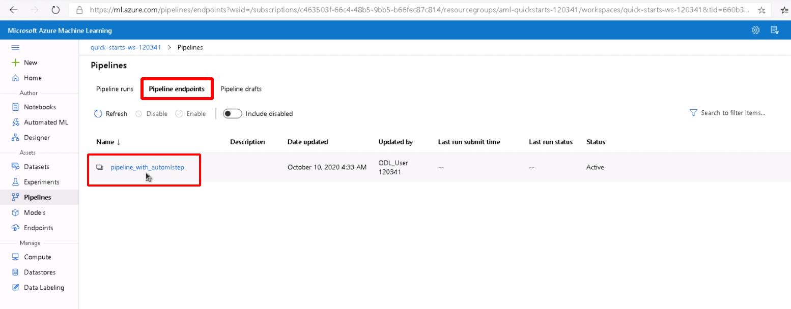
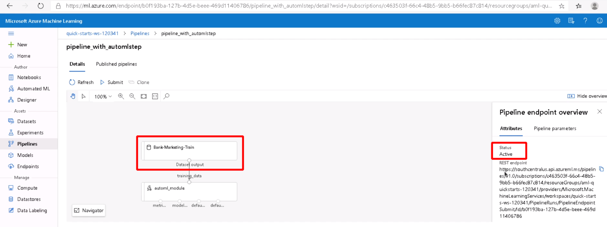
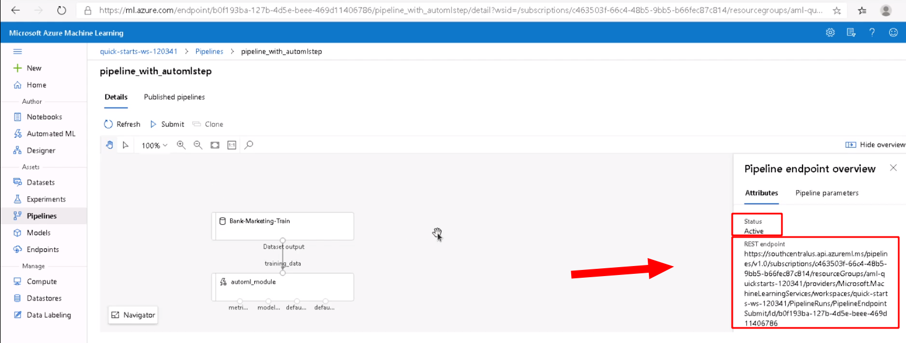
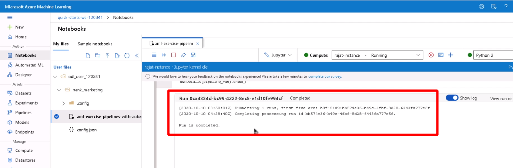
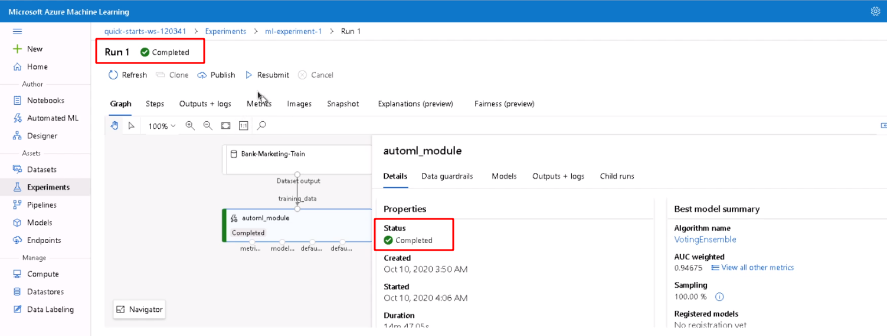

# Operationalizing Machine Learning

One of the most important things is that **"DevOps"** refers to the collection of principles that allow getting software into production, or in this case, trained models. MLOps (Machine Learning Operations) is about applying DevOps best-practices and principles to machine learning operations. This helps us to deliver innovation faster. 

In this project, I have used Azure to operationalize Machine Learning by configuring a cloud-based machine learning production model, then deploying the model as a web service API to Azure Container Instance (ACI) which helps to consume endpoints via HTTP. This enables us to use the model remotely from anywhere. Once deployed, we have a REST endpoint API to consume the deployed model.

This project also demonstrates the procedure of:
- Creating a pipeline
- Publishing a pipeline
- Interacting with a pipeline via an REST endpoint

Pipelines are very useful and are a foundation of automation and operations in general. Being able to create a Pipeline allows for easier interaction with model deployments.

## Key Steps of this project:
1. Automated ML Experiment
2. Deploy the best model
3. Enable logging
4. Swagger Documentation
5. Consume model endpoints
6. Create and publish a pipeline
7. Documentation

## Architectural Diagram

## Key Steps
## Step 1: Automated ML Experiment
The aim of this step is to create an experiment using Automated ML, configure a compute cluster, and use that cluster to run the experiment. Automated Machine Learning picks an algorithm and hyperparameters for us and generates a model ready for deployment.

#### Dataset

#### Completion of experiment

#### Selection of Best Model

## Step 2: Deploy the Model
After the experiment run completes, it's time to deploy the Best Model. Azure Machine Learning helps to deploy a model as a web service API on Azure Container Instances (ACI). 

## Step 3: Enable Application Insights
Once the Best Model is deployed, lets enable Application Insights and retrieve logs. Application Insights is a performance management service for web applications that enables us to do all the monitoring of the service.

#### Check for Application Insights

#### Running Logs script on terminal

#### Log Dashboard

## Step 4: Swagger Documentation
we are ready with the deployed model and enabled logs. Now it's time to test the REST APIs using Swagger. Swagger is a tool that helps build, document, and consume RESTful web services.

#### Swagger UI

## Step 5: Consume Model Endpoints
Once we finish the test, it's time to consume the deployed model via REST API endpoints. Here we will make an authenticated HTTP request to a deployed model service in Azure Container Services to retrieve data. The APIs exposed by Azure ML then uses JSON to accept data and submit responses.

#### Result after consuming endpoint

#### Apache benchmark

## Step 6: Create, Publish and Consume a Pipeline
In the repo, you will see a Jupyter Notebook which we used for creating, publishing and consuming pipeline. 

#### Created Pipeline in Azure ML studio

#### Pipeline Endpoint in Azure ML studio

#### Bankmarketing dataset with the AutoML module

#### REST Endpoint and status of Published Pipeline

#### RunDetails Widget

#### Scheduled Run in Azure ML studio

## Future Scope
The future scope of the project can be to:
* create a docker image for deploying the whole pipeline
* integrate a alert management system to get Emails for fault and error in the production.

## Brief Introductory Video

## License
Licensed under the [MIT License](https://github.com/rajatsharma369007/Operationalize-ML/blob/master/LICENSE) @ Udacity

## Issues/Bugs
Please open issues on github to report bugs or make feature requests

## Contribution
If you are interested in improving the code, please open an issue first to describe the task you are planning to do. For small fixes (a few lines of change) feel free to open pull requests directly.

